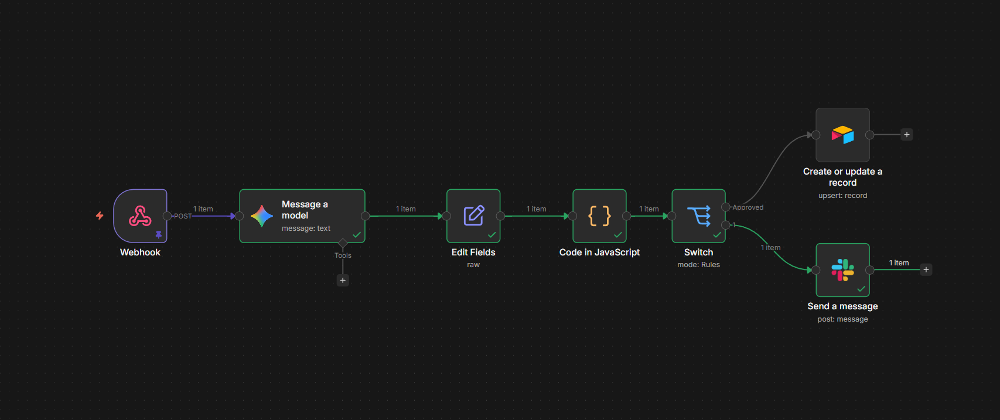

[View Workflow JSON File](KYC_Automation_Pipeline.json)
# Enterprise KYC AI-Automation Pipeline

## Overview
A high-integrity, automated Know Your Customer (KYC) validation system designed to handle unstructured identity documents with a deterministic safety layer.

## The Business Problem
Manual verification of identity documents (Visas/Passports) against applicant data is a high-latency bottleneck prone to human error and potential fraud, impacting placement speed in operational environments.

## System Architecture
- **Ingestion:** REST API / Webhooks.
- **Intelligence:** Google Gemini 2.5 Flash Vision (OCR extraction of unstructured ID data).
- **Validation Engine:** Custom JavaScript implementation of the Levenshtein Distance algorithm to normalize and validate name matches with a 95% threshold.
- **Data Persistence:** Airtable (CRM/ERP simulation).
- **Operational Logic:** Conditional routing for "Human-in-the-loop" overrides via Slack API on data discrepancies.

## Key Technical Features
- **Deterministic Reliability:** Does not rely solely on LLM judgment; uses hard-coded logic to prevent hallucinations.
- **API Resilience:** Implements error handling and cross-platform authentication (OAuth2/Access Tokens).
- **High Agency Design:** Automatically flags high-risk mismatches for manual review, ensuring 0% false approvals.

## Tech Stack
- n8n (Orchestration)
- Google Gemini (Vision AI)
- JavaScript (Data Processing)
- Airtable API (Database)
- Slack API (Alerting)
